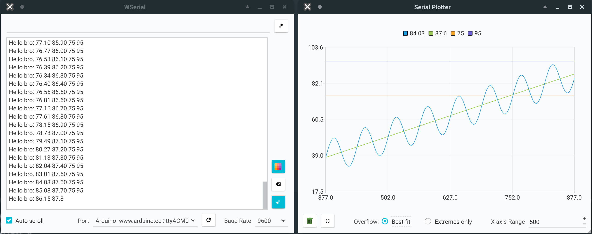

# WSerial

WSerial is a Serial Monitor and a Serial Plotter to visualize data from devices transmitting data using Serial. This is developed at [**Waterloop**](https://teamwaterloop.ca/) and is one of the best-in-class GUI design out there. You can either clone this project and follow the development instructions to build it locally or install our prebuilt binaries (they will be added soon).

## Features

- Scales well on HDPI devices
- Built using Qt so, it compiles directly on your machine
- Uses GPU with OpenGL acceleration instead of CPU for plotting data on the plotter for smooth user experience
- Flexibility to make the range of X Axis values of the plotter longer and shorter
- Y Axis scales based on the highest and the lowest value encountered on the screen, two options available for fine-tuning:
    - "Best fit" takes the visible portion of the plot and fits it as snugly as it can on the Y Axis
    - "Extremes only" (default) just increases the maximum/minimum limit of the Y Axis respectively when a maximum/minimum is reached
- Allows the opening of Serial window and the plotter at the same time
- Allows the user to pause the Serial output on the screen
- Allows for changing ports and baudrate

## Development Instructions for Windows
1. Install Open Source Qt from this [link](https://www.qt.io/download-qt-for-application-development)
2. Be sure to select the version of Qt and Qt installer to be >= 5.4. Under the Qt option, you can deselect everything but the following to make the install take up a lot less space:
    - `MinGW (gcc for Windows)`: for some reason, the one bundled with Qt is 32-bit only, but this is easy to use and compatible with `GCC`

      (and/or)

      `MSVC (MS Visual C++)`: have to install this compiler separately from Microsoft, this option only enables support under Qt
    - Sources: includes most of the Qt libraries, including the serial port library
    - Qt Charts: for the Serial Plotter

3. Open Qt Creator and drag wserial.pro into the window

## Development Instructions for Linux
1. You can either use your distro's Qt packages (recommended), or install Open Source Qt from this [link](https://www.qt.io/download-qt-for-application-development). The latter is preferable if your distro has not updated their Qt packages in a while (for example Ubuntu LTS), or if you don't have Qt version >= 5.4 available to you
2. Different distro's split up Qt into different packages, for example on Arch Linux, you need `qt5-base`, `qt5-serialport`, and `qt5-charts`. If you went with the installer option, look at the **Windows section** above for more details on what you need to select in the installer (you won't have `MSVC` or `MinGW`, since you need to install your distro's `gcc` on linux)
3. Open Qt Creator and drag `wserial.pro` into the window. Alternatively you can open the project from the menu and select `wserial.pro` file.
